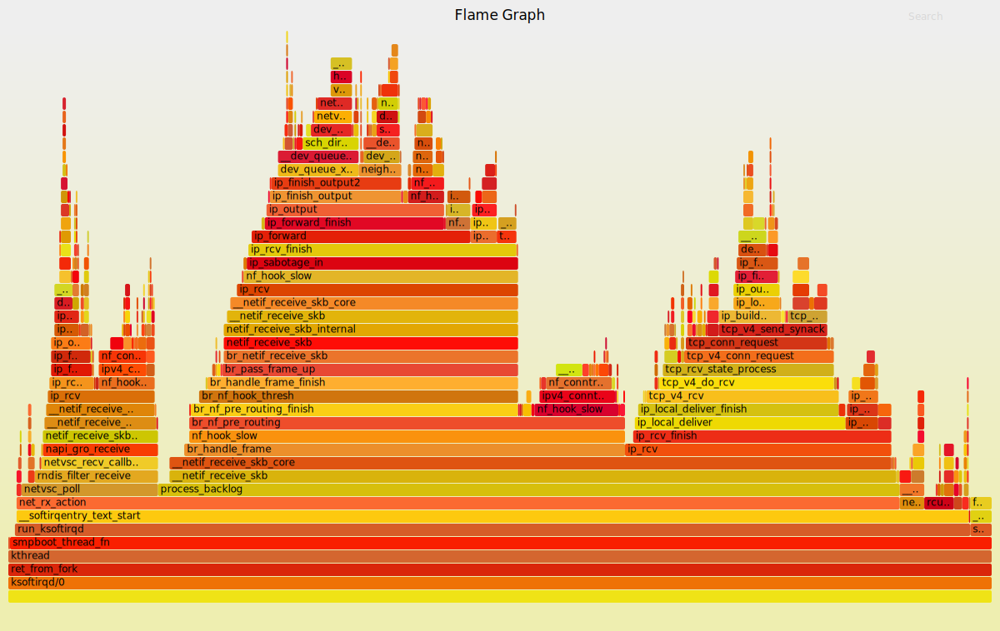
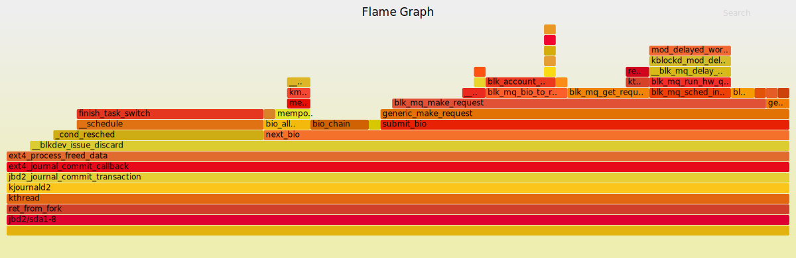

# 火焰图

[火焰图](http://www.brendangregg.com/flamegraphs.html) 可以以矢量图的方式动态展示通过 perf、systemtap、bpftrace 等各种工具获取的性能剖析数据。

## 使用方法

```sh
# 下载工具
$ git clone https://github.com/brendangregg/FlameGraph
$ cd FlameGraph

# 使用perf记录性能数据
$ perf record -a -g -- sleep 30

# 生成火焰图
$ perf script -i perf.data | ./stackcollapse-perf.pl --all |  ./flamegraph.pl > ksoftirqd.svg
```

## 示例火焰图

**MySQL 火焰图**


**ksoftirqd 火焰图**




**jbd2 火焰图**

